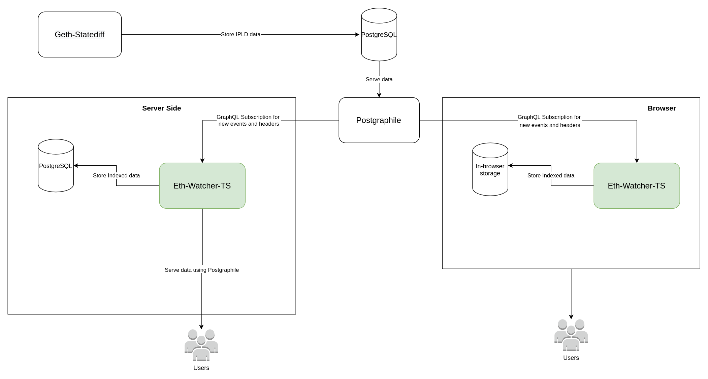

# Contract Watcher

## Requirements

* [NodeJS](https://nodejs.org/en/)
* Postgresql
* [geth-statediff](https://github.com/vulcanize/go-ethereum/releases/tag/v1.9.11-statediff-0.0.8)
* [ipld-eth-indexer](https://github.com/vulcanize/ipld-eth-indexer)
* [postgraphile](https://github.com/vulcanize/postgraphile)


## Application Diagram



## Getting Started

* Run geth-statediff with `--statediff` and `--rpcapi "web3,eth,net,debug,personal,statediff"` options , e.g. 
```
./geth-statediff --testnet --rpc --rpcapi "web3,eth,net,debug,personal,statediff" --rpccorsdomain '*' --rpcaddr="0.0.0.0" --rpcport="8545" --syncmode=full --statediff --ws --wsaddr="0.0.0.0"
```

* Run `ipld-eth-indexer`, e.g.
```
ETH_WS_PATH=localhost:8546 ./ipld-eth-indexer sync --database-hostname localhost --database-port 5432 --database-password dbpass --database-user dbuser --eth-chain-id 3
```

* Run postgraphile to expose data from database:

```
docker run -p 127.0.0.1:5000:5000 -e PG_HOST=pg-host -e PG_PORT=5432 -e PG_DATABASE=vulcanize_public -e PG_USER=dbuser -e PG_PASSWORD=dbpass -e SCHEMA=public,eth vulcanize/postgraphile:v1.0.1
```
(if you are running postgresql on localhost you need to get local ip address and set it as `PG_HOST` value)

## Run contract-watcher-js

```
cp config.example.toml config.toml
# edit database connections in config.toml
npm i
# run migrations
npm run migrate:up
# sync realtime events
npm run dev
```

## Configure contract address, ABI and events

* Add to table `contract.events` name of events that you want to watch, e.g.

```
INSERT INTO contract.events (name) VALUES ('Transfer');
INSERT INTO contract.events (name) VALUES ('Approval');
```

* Add to table `contract.contract` information about contract, e.g.

```
INSERT INTO contract.contracts (name, address, abi, events, methods, starting_block) VALUES ('Uni', '0xbb38B6F181541a6cEdfDac0b94175B2431Aa1A02', 'ABIHERE', '{1,2}', null, 1);
```

Then generate some events in Smart Contract and it will be populated to `data` schema in database.
